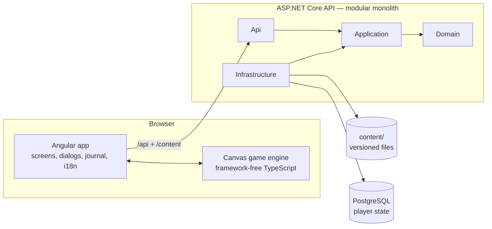

# Slovion

An original 2D exploration game set in a fictionalized Slovenia. Instead of fighting or catching monsters, the player walks through Slovenian landscapes, **observes real animals and plants, identifies them from sourced clues**, and fills a field journal (*Terenski dnevnik*).


- **Real nature, real sources:** every species fact cites its source; gameplay values (rarity, goals) are fictional and never shown as facts.
- **For all ages:** no combat, no capture, no accounts, no personal data, no GPS.
- **Slovenian first** (`sl-SI`); playable in the browser and installable as an app.

| Identify from clues | Fill the journal | Explore day and night |
|---|---|---|
|  |  |  |

**More:** [Gameplay](docs/gameplay.md) (the loop, regions, tools, controls) · [Architecture](docs/architecture.md) (diagrams, flows, data) · [Content](docs/content.md) (species, maps, quests)

## Architecture at a glance



- **The server decides what counts:** encounters, identification, the journal, quests, regions, the in-game clock and the weather.
- **The client decides what moves:** movement, collision and drawing. Angular runs the UI and talks to the API; the engine simulates and draws the world and never imports Angular.
- **Content is files, state is rows:** species, maps and quests are validated files in `content/`; PostgreSQL stores only what each anonymous save did.

The details, with backend, frontend, engine and data diagrams and request flows, are in [docs/architecture.md](docs/architecture.md).

| Area | Technology |
|---|---|
| Backend | .NET 10, ASP.NET Core minimal APIs, EF Core, OpenAPI |
| Database | PostgreSQL (Docker for local development) |
| Frontend | Angular, Transloco |
| Game | TypeScript on HTML Canvas, maps from [Tiled](https://www.mapeditor.org/) |
| Tests | xUnit, Vitest, Playwright |

## Getting started

Prerequisites: [.NET 10 SDK](https://dotnet.microsoft.com/download) (pinned in `global.json`), [Node.js 24](https://nodejs.org/), [Docker](https://www.docker.com/products/docker-desktop/).

```bash
docker compose up -d db                  # PostgreSQL on localhost:5432
dotnet run --project src/Slovion.Api     # API on http://localhost:5080 (migrations run at startup)

cd client
npm ci
npm start                                # game on http://localhost:4200
```

Checks (CI runs the same on every push and pull request, plus a container smoke test; merges to `main` deploy automatically — see [docs/hosting.md](docs/hosting.md)):

```bash
dotnet format Slovion.slnx --verify-no-changes
dotnet test --solution Slovion.slnx      # unit, architecture, integration (needs Docker)

cd client
npm run check                            # format, lint, translation keys, tests, build
npm run e2e                              # plays the demo path in Chromium (needs the database)
# next to your own running servers: E2E_API_PORT=5180 E2E_CLIENT_PORT=4300 npm run e2e
```

## Repository

```text
src/        backend: Slovion.Domain → Application → Infrastructure → Api
tests/      backend tests: domain, application, integration, architecture
client/     Angular app (src/app) and the game engine (src/engine)
content/    game content: species, maps, quests, regions, art
deploy/     container images, production stack, VM setup and backup scripts
docs/       architecture, gameplay, content, hosting, decisions, product vision
openspec/   capability specs and change proposals
```

## How work is done

Slovion grows one validated slice at a time with [OpenSpec](https://github.com/Fission-AI/OpenSpec): **spec → plan → implement → validate**. Each change that alters behaviour starts as a proposal in `openspec/changes/<id>/` (proposal, design, tasks, spec deltas). When it's done, it's archived and its deltas merge into the capability specs in [`openspec/specs/`](openspec/specs/).

| Document | Contents |
|---|---|
| [docs/architecture.md](docs/architecture.md) | How everything is connected |
| [docs/gameplay.md](docs/gameplay.md) | The game as the player sees it |
| [docs/content.md](docs/content.md) | Content files and checklists for new species and regions |
| [docs/hosting.md](docs/hosting.md) | Production on Oracle Cloud: setup, deploys, backups, operations |
| [docs/decisions.md](docs/decisions.md) | Binding product and architecture decisions (D1–D11) |
| [docs/product-vision.md](docs/product-vision.md) | Vision, systems and roadmap |
| [CLAUDE.md](CLAUDE.md) | Rules for the AI development agent |

Pictures in the docs are generated from the running game by [`client/scripts/docs-media/capture.mjs`](client/scripts/docs-media/capture.mjs); rerun it when something visible changes.

## Content and IP

Slovion is an original IP inspired by the *genre* of classic handheld exploration games. It uses no assets, names, characters or data from existing franchises. "Slovion" is a working title; name and trademark availability have not been checked yet.
