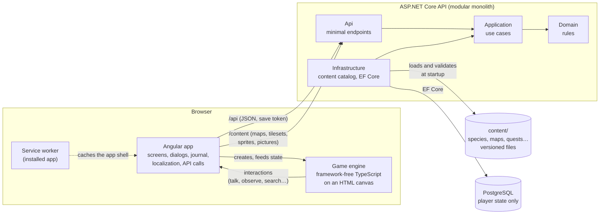
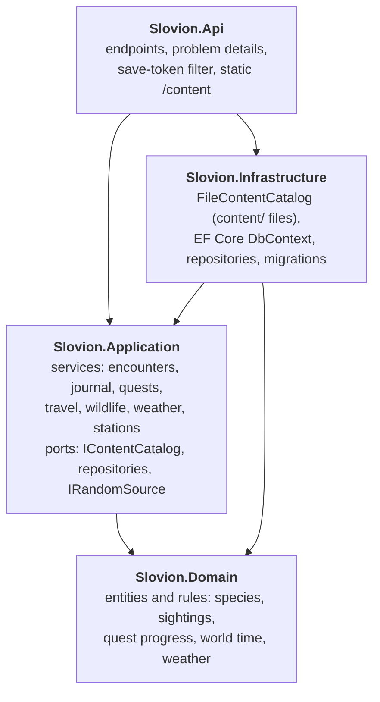
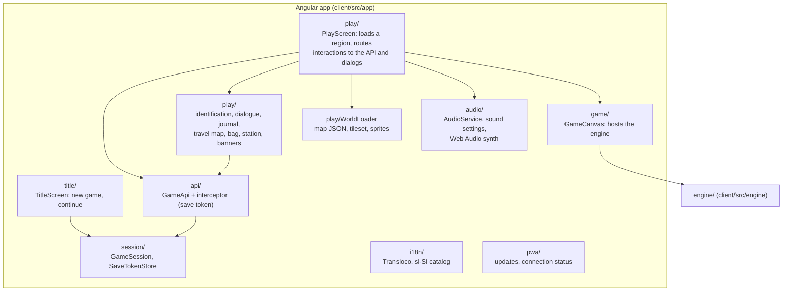
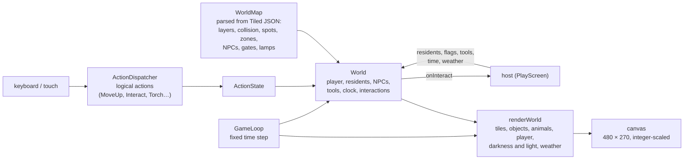
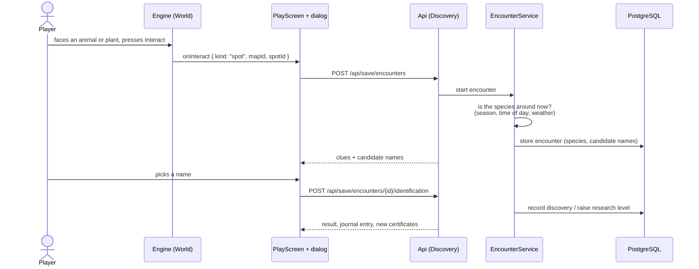
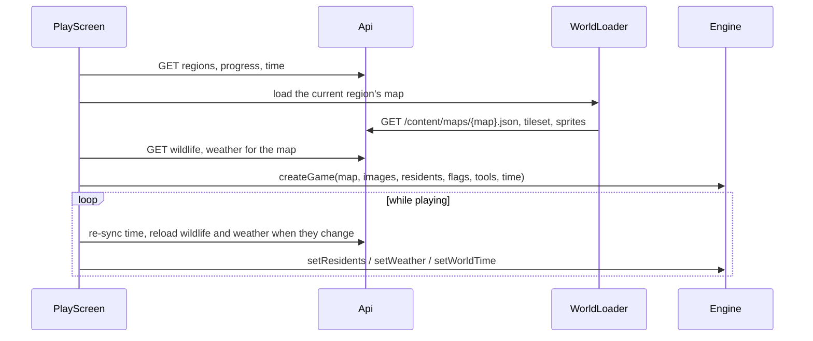
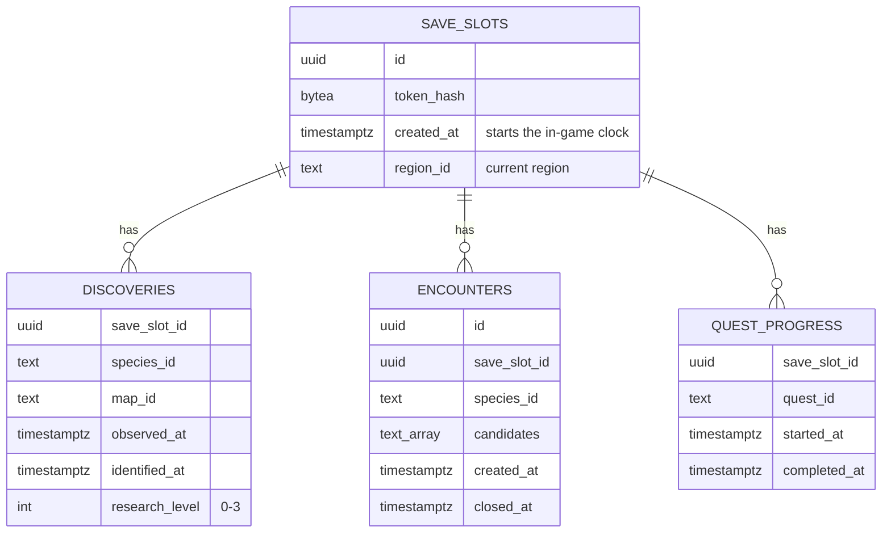
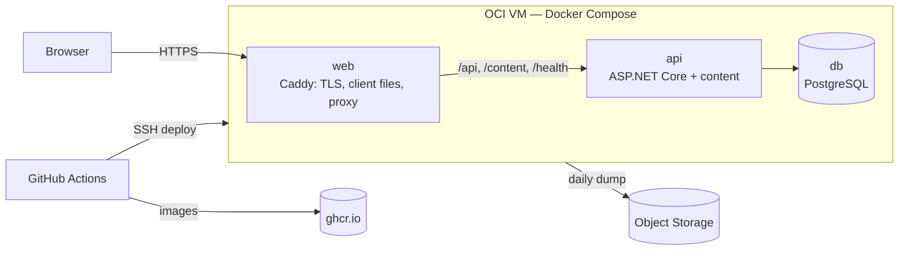

# Architecture

How Slovion fits together, from the browser to the database. The binding rules behind it are in [decisions.md](decisions.md) (D1–D11); the behaviour of each part is specified in [`openspec/specs/`](../openspec/specs/).

- [The whole system](#the-whole-system)
- [Who decides what](#who-decides-what)
- [Backend](#backend)
- [Frontend](#frontend)
- [Game engine](#game-engine)
- [Request flows](#request-flows)
- [Data](#data)
- [Deployment](#deployment)
- [Where to change what](#where-to-change-what)

## The whole system

- **Content is files, state is rows.** Species, maps, quests and the rest live as versioned files in [`content/`](../content/) (D7). The API refuses to start if any of them is invalid. PostgreSQL stores only what a save did: discoveries, encounters, quests, the current region.
- **One server, layered.** A modular monolith (no microservices): four projects with strict dependencies, organized inside by feature folders.
- **Two client layers.** Angular owns every screen and all communication; the engine only simulates and draws the world. The engine never imports Angular or RxJS (lint rule), so it stays a plain, testable TypeScript library.
- **Anonymous saves.** A new game creates a save slot and returns a random token, kept in the browser (D4, D5). Every `/api/save/*` call sends it as a bearer token; the server stores only its hash.

## Who decides what

The split follows D3: the server is the authority for everything that counts, the client for everything that moves.

| The server decides | The client decides |
|---|---|
| What can be found where, and when (time, season, weather) | Movement, collision, the camera |
| Encounters, identification, the journal and research levels | Drawing tiles, animals, light and weather |
| Quests, rewards, tools, unlocked regions | Which tile the player faces and what that means (talk, observe, search) |
| The in-game clock (from the save's creation time) and the weather | Animals wandering and reacting to the torch, between server updates |

Randomness and time are injected on both sides (`IRandomSource` and `TimeProvider` on the server; seeded random and a fake clock in the engine), so every rule is tested deterministically.

## Backend

- **Domain** depends on nothing. **Application** defines the ports it needs (`IContentCatalog`, the repositories, `IRandomSource`); **Infrastructure** implements them. **Api** is the composition root. [`tests/Slovion.ArchitectureTests`](../tests/Slovion.ArchitectureTests/) enforce these rules.
- **Feature folders** cut across the layers with the same names, so one feature is easy to find in every project:

  | Feature | What it covers | Endpoints (`/api/save/…` unless noted) |
  |---|---|---|
  | Saves | anonymous save slots and tokens | `POST /api/saves` |
  | Discovery | searching, encounters, identification, the journal (NatureDex), research levels | `searches`, `encounters`, `encounters/{id}/identification`, `naturedex` |
  | Quests | talking to people, quest state, flags, tools | `conversations`, `progress` |
  | Travel | regions, unlock rules, the current region | `regions`, `travel` |
  | Wildlife | which resident animals are around now | `wildlife` |
  | World | the in-game clock and the weather | `time`, `weather` |
  | Stations | research stations and certificates | `stations` |
  | Content | the validated content catalog; maps, tilesets, sprites and pictures as static files | `GET /content/…` |

- **Errors** are RFC 7807 problem details with a stable `code` (e.g. `unknown_map`, `invalid_save_token`); the client translates codes, never server text (D7).
- **OpenAPI** is served at `/openapi/v1.json` in development.

## Frontend

- **`PlayScreen` is the conductor.** It loads the current region (regions, progress, time, wildlife, weather, the map and its images), creates the game through `GameCanvas`, and turns each engine interaction into an API call and a dialog. While a dialog is open, input goes to the UI instead of the world.
- **Sound is synthesized** with Web Audio in `audio/synth/` (framework-free like the engine, tested against a fake audio context). `AudioService` makes the audio context on the first click or key press, loads the themes and soundscapes from `public/audio/`, and stops while the page is hidden; `PlayScreen` tells it the scene (map, time of day, weather, underground) and which effect to play. Sound never affects the game.
- **All text is translated.** UI text comes from the `sl-SI` catalog (`public/i18n/sl.json`, checked by `npm run i18n:check`); content text comes localized from the API (D7).
- **The installed app** (PWA) caches the built app shell with its music and soundscapes, never `/api` or `/content`; playing needs the server, and a new version shows *Osveži*. The dev server never registers the service worker. To try it locally: run the API, then `npm run build` and `node e2e/serve-dist.mjs 4201` in `client/`, and open http://localhost:4201.

## Game engine

- **`createGame`** (`game.ts`) wires everything: input, the loop, the world, the renderer and a `GameEnvironment` (clock, frame scheduler, size and visibility), which tests replace with fakes.
- **Logical actions only.** Game code reacts to `MoveUp`, `Interact`, `Torch`…, never to keys; the keyboard map lives in one place.
- **Maps are data.** `tiled.ts` parses and validates Tiled JSON into a `WorldMap`; tile properties (`wadeable`, `swimmable`) and object classes (`spot`, `habitat`, `area`, `npc`, `gate`, `signpost`, `station`, `lamp`) drive behaviour. See [content.md](content.md).
- **Drawing** happens at a logical 480 × 270, scaled by whole numbers for crisp pixel art. The time-of-day tint goes into an offscreen layer, and the torch and lamp posts cut soft circles of light out of it.

## Request flows

**Observing and identifying an animal or plant**

Searching tall grass or a tree works the same way through `POST /api/save/searches`: the server picks a plant from the habitat zone's weighted list (fictional rarity values) and opens an encounter.

**Entering a region**

Talking to someone (`POST conversations`) returns the dialogue for the quest's state and the save's new flags and tools; travelling (`POST travel`) sets the current region, and the play screen loads the new map.

## Data

- **Derived, not stored:** progress flags and tools come from completed quests, unlocked regions from flags, station certificates from research levels, the in-game time from `created_at`. Changing content therefore never needs a data migration.
- **Migrations** run at API startup (EF Core, `src/Slovion.Infrastructure/Persistence/Migrations`). To add one: `dotnet tool restore`, then `dotnet ef migrations add <Name> --project src/Slovion.Infrastructure --output-dir Persistence/Migrations`.

## Deployment

Production is one Oracle Cloud Always Free Arm VM running a Docker Compose stack (D12):

- **Same origin as in development:** Caddy serves the built client and forwards `/api`, `/content` and `/health` to the API, so the client needs no configuration.
- **Images:** `deploy/api.Dockerfile` and `deploy/web.Dockerfile`, cross-built for `arm64` and `amd64`. CI builds them on every pull request and runs `deploy/smoke-test.sh` against the whole stack.
- **Deploys:** publishing a release deploys it with `.github/workflows/deploy.yml` (CI must have passed for its commit), with a health check and an automatic rollback.

Setup, secrets, backups and operations are in [hosting.md](hosting.md).

## Where to change what

| To… | Change | Specs and tests |
|---|---|---|
| Add a species, region, quest, tool or station | Content files only — see [content.md](content.md) | Content validation runs at startup and in `dotnet test` |
| Add a game rule the server decides | `Domain` (rule) and `Application` (use case), an endpoint in `Api/<Feature>` | Domain and application tests, integration tests |
| Add something that moves or is drawn | `client/src/engine/` (world, renderer, tiled parser) | Engine tests with `textMap` and a fake environment |
| Add music, ambience or a sound effect | `client/public/audio/` (data) or `client/src/app/audio/synth/` — see [content.md](content.md#sound) | Synth tests with the fake audio context, the audio data test |
| Add a screen, dialog or text | `client/src/app/` and `public/i18n/sl.json` | Component tests, `npm run i18n:check` |
| Store new player state | an entity in `Domain`, its configuration and a migration in `Infrastructure` | Integration tests (need Docker) |
| Change how the game is hosted or deployed | `deploy/`, `.github/workflows/deploy.yml`, [hosting.md](hosting.md) | The container smoke test in CI |
| Change the docs' pictures | rerun [`client/scripts/docs-media/capture.mjs`](../client/scripts/docs-media/capture.mjs) | — |

Every change that alters behaviour starts as an OpenSpec change (`openspec/changes/<id>/`) — see the [README](../README.md#how-work-is-done).
