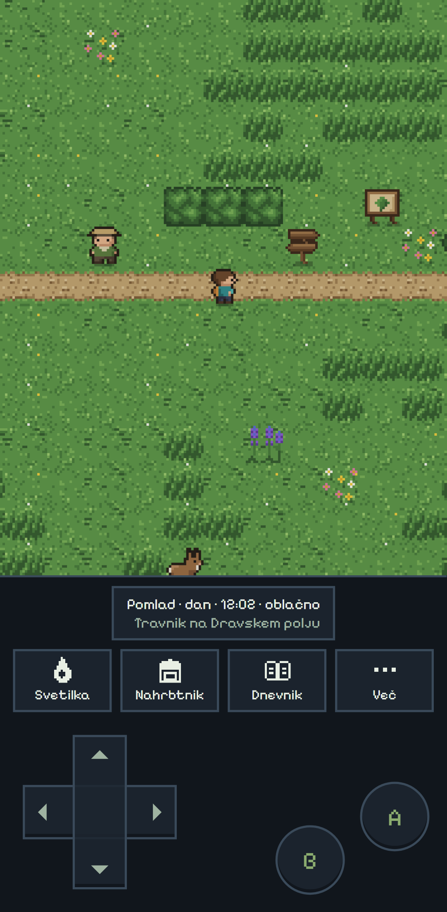
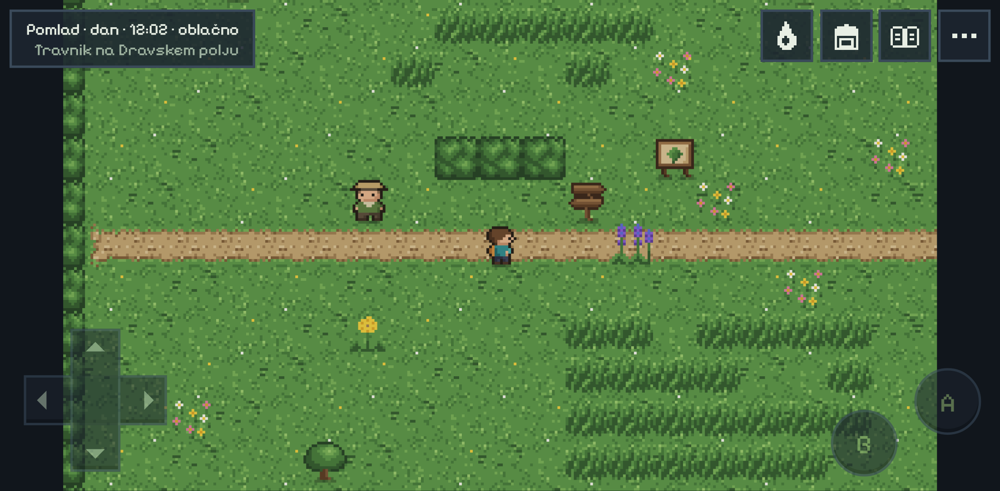

# Gameplay

Slovion is about **observing real Slovenian nature**: walk through a region, meet animals and plants, identify them from sourced clues, and fill a field journal. There is no combat and no capture (D2); the player collects observations.

> **Explore → Discover → Identify → Learn → Collect → Progress → Explore further**

## The core loop

1. **Explore** a region on foot: tile by tile, with the keyboard or the on-screen D-pad.
2. **Discover** species:
   - **Animals** live in the world as residents: they wander near home, wait when the player comes close, and react to the torch at night.
   - **Plants** are found by searching tall grass, a tree or a shrub inside a habitat.
   - What can be found depends on the **season, the time of day and the weather**, all decided by the server and backed by sources (a winter meadow is quiet; salamanders come out in the rain).
3. **Identify** the species from clues: one clue at a time, then pick the right name. A wrong guess teaches the name without counting it, and the species can be observed again.
4. **Learn** on its page in *Terenski dnevnik* (the journal, D10): Slovenian facts, each with its source. The journal has one page per habitat, every picture labelled with its name (or `???` until identified):
   - **Wide screens:** an index of all habitats with their progress sits beside the page; finished habitats show their count in yellow.
   - **Phones:** ◀ and ▶ turn the pages.
   - **Arrow keys and the D-pad:** they also turn the page past its first or last picture.
5. **Research** further: seeing a species again at another time of day, or on another day, raises its research level up to ★★★ and reveals more of its page.
6. **Progress:** people in each region give a quest. Finishing it opens the next region, and some quests give a field tool.

| Observing a species | The journal | A species page |
|---|---|---|
|  |  |  |

## Every save, its own world

Every region is generated for each save (docs/decisions.md D13): a new game gets its own patches of tall grass, its own place for the gate in the hedge, its own row of houses in the towns, stands of trees, scree and snowfields, reed beds and shallows, a river through the gorge and a cave pool, and paths through them, and keeps them for good. The spawn, the signpost, the person and the station stay where they always are, so quests and travel work the same. The animals and plants live where they belong: the meadow sage close to the spawn for the first quest, the red deer at the forest edge or in a clearing, the edelweiss by the scree, the water lily out in the shallows (bring the boots), the olm in the cave pool. The stork always nests on a farmhouse chimney, and the pen shell still waits out in the shallows for the snorkel.

## Time, seasons and weather

- **One real second is one in-game minute.** A day has a morning, day, evening and night; a season lasts three in-game days. The clock belongs to the save and runs on the server (D8).
- **Darkness:** evenings and nights are tinted, and caves are dark at any time. The torch (*svetilka*, key L) lights a circle; street lamps light their own.
- **Weather** (clear, cloudy, rain, fog, snow) is decided per region every six in-game hours and drawn over the map (D11).

## The journey

A signpost (*kažipot*) by every arrival point opens the travel map. Regions open one after another, each through the quest of the region before. The game continues in the region where the player last was.

| # | Region | Person | Quest | Opened by | What is special |
|---|---|---|---|---|---|
| 1 | Dravsko polje | Vera | *Oko za naravo* | always open | the meadow and a hedgerow behind a gate |
| 2 | Kočevje | Jure | *V senci jelk* | Vera's quest | fir and beech forest, the brown bear, a stream to wade |
| 3 | Pohorje | Maja | *Skrivnosti barja* | Jure's quest | mountain forest and a bog, the wolf |
| 4 | Triglav | Luka | *Pod vrhovi* | Maja's quest | alpine grassland, the chamois and the marmot |
| 5 | Cerkniško jezero | Neža | *Presihajoče jezero* | Luka's quest | a wetland with shallows, the corncrake at dusk |
| 6 | Rakov Škocjan | Tilen | *V temo* | Neža's quest | a karst gorge and a dark cave with the olm |
| 7 | Ljubljana | Ana | *Mestna narava* | Tilen's quest | a city park with street lamps, the Ljubljanica, the barje |
| 8 | Murska Sobota | Štefan | *Pod štorkljinim gnezdom* | Ana's quest | a Prekmurje village, the stork on a chimney |
| 9 | Portorož | Nina | *Med solinami in morjem* | Štefan's quest | the Sečovlje salt pans and the sea |

| A dark cave with the torch | A stork on its chimney | Swimming with the snorkel |
|---|---|---|
|  |  |  |

## Field tools

The bag (*Nahrbtnik*, key I) holds the tools a save has; each one opens a new way to observe.

| Tool | From | What it does |
|---|---|---|
| *svetilka* (lamp) | the start | lights a circle in the dark; animals react to it |
| *daljnogled* (binoculars) | Vera | identify animals from up to three tiles away |
| *povečevalno steklo* (magnifier) | Jure | see two clues at once for plants and insects |
| *škornji* (rubber boots) | Maja | wade through streams and shallows |
| *maska z dihalko* (snorkel) | Nina | swim in shallow sea and meet the life there |

## Sound

Every region has its own soft chiptune theme and a bed of nature sounds: wind, water, generic birdsong, crickets at night. At night the theme plays slower and quieter; caves have their own theme with dripping water. Rain is heard over the ambience and thins out the birds; snow silences them. Short sounds mark an observation, a right or wrong name, research, a finished quest, a new tool, a certificate, travel, the torch and a search. Everything is synthesized in the browser, and no sound stands for a particular species.

Sound starts with the first click or key press. *Utišaj* mutes it; *Zvok* opens separate volumes for music, sounds and nature. Both are remembered on the device.

## Research stations

Every region has a research station (*raziskovalna postaja*) with a themed list of species, such as forest trees, birds or the sea and salt pans. Fully researching enough of them (★★★) earns a certificate (*potrdilo*) on the journal's *Potrdila* page.

## Controls

| Action | Keys | Touch |
|---|---|---|
| Walk / run | arrow keys or WASD / hold Shift | D-pad / hold B while walking |
| Interact: talk, observe, search, read the signpost | E, Enter or Space | A |
| Torch | L | *Svetilka* |
| Bag | I | *Nahrbtnik* |
| Journal (*Terenski dnevnik*) | M | *Dnevnik* |
| Close, go back | Esc | B |

The sound settings (*Zvok*) use up and down to choose a volume, left and right to change it, and Enter to mute. Dialogs use the arrows and Enter, or the D-pad, A and B; their buttons can also be clicked or tapped.

**The screen is the game.** The world takes the largest 16:9 view the screen allows, drawn crisply at a whole multiple of its 320×180 pixels and only smoothed for the last step between two multiples, never stretched. Over it sits a small HUD:
- top left: the season, time, weather and place, and the active quest, which folds to its title with a click
- top right: *Svetilka*, *Nahrbtnik*, *Dnevnik* and *Več*, which work with mouse and touch

*Več* (more) holds what is needed less often: *Zvok*, *Utišaj* and *Cel zaslon*, and for keyboard players the list of keys, which also shows over the world for a few seconds when a game starts. *Cel zaslon* switches to fullscreen where the browser allows it; on iPhone, adding Slovion to the home screen runs it full screen.

**On phones and tablets** the D-pad and the A and B buttons appear. Held upright, the world is zoomed in and fills the screen from the top down to the time-and-place line: it shows 11×15 tiles, so everything is much larger than on a wide screen (a short phone shows 15×11). The quest lies over its top-left corner and folds to one line. Below come one row with the game's buttons and the controls at the bottom, like a handheld console. Held sideways, the world fills the screen's height, the HUD buttons show only their icons and the controls sit see-through in the corners. Every button is at least 44 pixels for a finger, and nothing hides under a notch or the home bar.

| Upright | Sideways |
|---|---|
|  |  |

## Where gameplay is defined

- **Behaviour:** the capability specs in [`openspec/specs/`](../openspec/specs/), e.g. [`identification`](../openspec/specs/identification/spec.md), [`wildlife`](../openspec/specs/wildlife/spec.md), [`regions`](../openspec/specs/regions/spec.md).
- **Species, regions, quests and tools:** content files, described in [content.md](content.md).
- **The ideas ahead:** [product-vision.md](product-vision.md).
