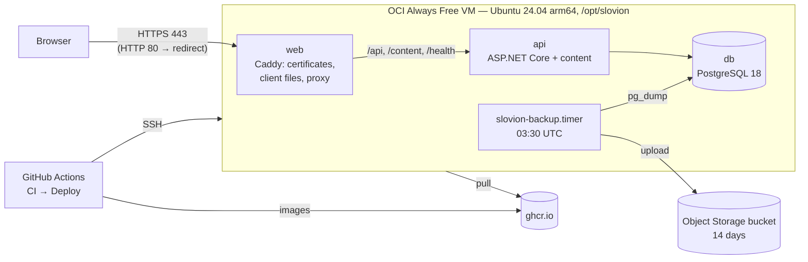

# Hosting

Slovion runs on one **Oracle Cloud (OCI) Always Free** Arm VM, as a Docker Compose stack (D12). GitHub Actions deploys each published release. This page covers setting it up once, the deploy pipeline, and day-to-day operations.

- [How it fits together](#how-it-fits-together)
- [One-time setup](#one-time-setup)
- [Deploying](#deploying)
- [Switching to a domain](#switching-to-a-domain)
- [Backups and restore](#backups-and-restore)
- [Operations](#operations)
- [Troubleshooting](#troubleshooting)

## How it fits together



| Piece | Where it is defined |
|---|---|
| API image (with the game content) | [`deploy/api.Dockerfile`](../deploy/api.Dockerfile) |
| Web image (Caddy and the built client) | [`deploy/web.Dockerfile`](../deploy/web.Dockerfile), [`deploy/Caddyfile`](../deploy/Caddyfile) |
| The stack | [`deploy/compose.yml`](../deploy/compose.yml) |
| VM setup (run once) | [`deploy/bootstrap.sh`](../deploy/bootstrap.sh) |
| Daily backup | [`deploy/backup.sh`](../deploy/backup.sh), a timer installed by the bootstrap |
| Smoke test (CI and by hand) | [`deploy/smoke-test.sh`](../deploy/smoke-test.sh) |
| Deploy pipeline (on releases) | [`.github/workflows/deploy.yml`](../.github/workflows/deploy.yml) |

Configuration and secrets live in the GitHub environment **`production`**. Each deploy writes them to `/opt/slovion/.env` on the VM, so nothing secret is in the repository:

| Name | Kind | What it is |
|---|---|---|
| `DEPLOY_HOST` | secret | the VM's public IP |
| `DEPLOY_USER` | secret | `slovion` |
| `DEPLOY_SSH_KEY` | secret | the private deploy key (its public half goes to the bootstrap) |
| `DEPLOY_KNOWN_HOSTS` | secret | the VM's SSH host keys (`ssh-keyscan`), so the pipeline only talks to this VM |
| `POSTGRES_PASSWORD` | secret | the database password (letters and digits) |
| `BACKUP_URL` | secret | the bucket's pre-authenticated write URL (ends with `/o/`) |
| `SITE_ADDRESS` | variable | the host name: `203-0-113-7.sslip.io` until a domain exists |

## One-time setup

### 1. The Oracle Cloud account

1. Sign up at [cloud.oracle.com](https://cloud.oracle.com). The **home region** can't be changed later, and Arm capacity varies by region, so if a busy region keeps saying *Out of capacity*, a less busy one helps.
2. Recommended: **upgrade to Pay As You Go** (*Billing → Upgrade and Manage Payment*). Always Free resources stay free. The upgrade avoids most *Out of capacity* errors, and idle Always Free VMs are no longer reclaimed. Add a **budget alert** (e.g. 1 €) under *Billing → Budgets* to be warned of any cost.

### 2. The VM

1. *Compute → Instances → Create instance*:
   - **Image:** Canonical Ubuntu 24.04 (aarch64)
   - **Shape:** *Ampere* → `VM.Standard.A1.Flex`, e.g. 2 OCPUs and 12 GB memory. Always Free covers up to 4 OCPUs and 24 GB in total.
   - **Networking:** a new VCN with a public subnet, and *Assign a public IPv4 address*
   - **SSH keys:** upload *your own* public key, for logging in as `ubuntu`
2. Note the instance's **public IP**.
3. Open the web ports: *Networking → Virtual cloud networks → (your VCN) → Security Lists → Default Security List → Add Ingress Rules*. Add two rules, source `0.0.0.0/0`, protocol TCP, destination ports **80** and **443**.

### 3. The backup bucket

1. *Storage → Buckets → Create bucket*: name `slovion-backups`, Standard tier, private (no public access).
2. **Retention:** *Lifecycle Policy Rules → Create rule*: *Delete* objects older than **14 days**.
   - OCI requires a policy that lets Object Storage apply lifecycle rules. Under *Identity → Policies → Create policy* (root compartment), add:
     `Allow service objectstorage-<region-id> to manage object-family in tenancy`
   - The region ID is e.g. `eu-frankfurt-1`.
3. **Write link:** *Pre-Authenticated Requests → Create*: target *Bucket*, access **Permit object writes**, and an expiration far ahead (e.g. one year; renew it before it expires). Copy the URL now; it is shown only once and ends with `/o/`.

### 4. Prepare the VM

From a machine with the GitHub CLI signed in to the repository (the agent can do these steps when given the IP):

```bash
# A dedicated deploy key, used only by GitHub Actions.
ssh-keygen -t ed25519 -N "" -C slovion-deploy -f slovion-deploy

# Copy the setup script to the VM and run it with the deploy key's public half.
scp deploy/bootstrap.sh ubuntu@<ip>:
ssh ubuntu@<ip> "sudo bash bootstrap.sh '$(cat slovion-deploy.pub)'"
```

The script:
- installs Docker and automatic security updates
- creates the `slovion` user and `/opt/slovion`
- opens ports 80 and 443 in the VM's own firewall (Oracle's Ubuntu images block them by default)
- turns off SSH password login
- installs the daily backup timer

Running it again is safe.

### 5. The GitHub environment

```bash
repo=David-Letonja-CTG/Slovion
gh api -X PUT "repos/$repo/environments/production" > /dev/null

gh secret set DEPLOY_HOST        --env production --repo $repo --body "<ip>"
gh secret set DEPLOY_USER        --env production --repo $repo --body slovion
gh secret set DEPLOY_SSH_KEY     --env production --repo $repo < slovion-deploy
ssh-keyscan -t ed25519,ecdsa,rsa <ip> 2>/dev/null | gh secret set DEPLOY_KNOWN_HOSTS --env production --repo $repo
openssl rand -hex 24 | gh secret set POSTGRES_PASSWORD --env production --repo $repo
gh secret set BACKUP_URL         --env production --repo $repo     # paste the write URL when asked
gh variable set SITE_ADDRESS     --env production --repo $repo --body "<ip with dashes>.sslip.io"

rm slovion-deploy slovion-deploy.pub   # GitHub and the VM hold everything that is needed
```

[sslip.io](https://sslip.io) turns `203-0-113-7.sslip.io` into the IP `203.0.113.7`, so the site gets a real HTTPS certificate before a domain exists. HTTPS is needed to install the game as an app.

## Deploying

Merging into `main` only runs CI. The game goes live by **publishing a release**:

```bash
gh release create v0.2.0 --generate-notes        # or GitHub → Releases → Draft a new release
```

- Version tags look like `v1.2.3`: raise the last number for fixes, the middle one for new features, the first for big changes.
- A release marked as a **pre-release** doesn't deploy.
- The release's commit must be on `main` with a passing CI run; the workflow waits for a CI run still in progress.

When a release is published, the **Deploy** workflow:
  1. builds both images for `arm64` and `amd64` and pushes them to `ghcr.io/david-letonja-ctg/slovion-api` and `slovion-web`, tagged with the commit and the version
  2. copies `compose.yml`, `backup.sh` and the new `.env` to the VM, then pulls and restarts the stack
  3. waits up to 3 minutes for `https://<SITE_ADDRESS>/health`
- **Rollback:** if the health check fails, the workflow restores the previous `.env` (the previous image tag), restarts, and marks the run failed.
- **By hand:** *Actions → Deploy → Run workflow* with a version tag redeploys that version, e.g. after changing a secret such as `BACKUP_URL`.
- The API applies database migrations when it starts. A deploy makes the game unavailable for a few seconds.

## Switching to a domain

1. At the DNS provider, add an `A` record for the domain (and `www` if wanted) pointing to the VM's IP.
2. `gh variable set SITE_ADDRESS --env production --repo David-Letonja-CTG/Slovion --body example.si`
3. Run the **Deploy** workflow by hand with the current version (or publish a new release). Caddy gets a certificate for the domain on the first request.

Once the domain is final, strict transport security (HSTS) can be added to the `Caddyfile`. It isn't sent on `sslip.io`, so the host name can still change.

## Backups and restore

- **Every day at 03:30 UTC** (plus a few random minutes), `slovion-backup.timer` runs `/opt/slovion/backup.sh`:
  1. a `pg_dump` in custom format to `/opt/slovion/backups/slovion-<UTC time>.dump`
  2. an upload to the bucket through `BACKUP_URL`
  3. only the newest 3 dumps are kept on the VM
- **The bucket** deletes dumps after 14 days.

Run a backup now, or look at the last runs:

```bash
sudo systemctl start slovion-backup
systemctl list-timers slovion-backup
journalctl -u slovion-backup --since today
```

**Restore** a dump. The dumps belong to the `slovion` user, so work as that user:

```bash
sudo -iu slovion
cd /opt/slovion
ls backups/                       # the local dumps, newest last
docker compose stop web api
docker compose cp backups/slovion-<time>.dump db:/tmp/restore.dump
docker compose exec -T db pg_restore -U slovion -d slovion --clean --if-exists /tmp/restore.dump
docker compose exec -T db rm /tmp/restore.dump
docker compose start api web
```

For a dump from the bucket, download it in the console, copy it to the VM (`scp slovion-<time>.dump ubuntu@<VM IP>:`), and hand it to `slovion` before the steps above:

```bash
sudo install -o slovion -g slovion -m 600 ~/slovion-<time>.dump /opt/slovion/backups/
```

## Operations

All of these run as the `slovion` user (`sudo -iu slovion`) in `/opt/slovion`:

| Task | Command |
|---|---|
| Status | `docker compose ps` |
| Logs | `docker compose logs -f api` (or `web`, `db`) |
| Restart | `docker compose restart api` |
| Disk usage | `docker system df`, `df -h` |

- **Database password:** PostgreSQL sets its password only when the data volume is first created. To change `POSTGRES_PASSWORD` later, first change it inside the database (`ALTER USER slovion PASSWORD '…'`), then update the secret and deploy.
- **PostgreSQL version:** the image is pinned (`postgres:18.6`) in `deploy/compose.yml`, `docker-compose.yml`, the E2E job in `.github/workflows/ci.yml` and the integration tests' `PostgresFixture.cs`, so a deploy never restarts the database for a new image by surprise. To update within PostgreSQL 18, change the tag in all four, let CI pass, and release; the deploy recreates the database container on the same data volume. A new major version (19) needs a dump and restore instead.
- **Renewals:** the pre-authenticated backup URL expires; create a new one and update `BACKUP_URL` before then. TLS certificates renew themselves.
- **Logs** are capped at 3 × 10 MB per container.
- **Check from outside**, from a checkout of the repository: `bash deploy/smoke-test.sh https://<SITE_ADDRESS>`.

## Troubleshooting

| Symptom | Check |
|---|---|
| *Out of capacity* when creating the VM | Try again later, try another availability domain, or upgrade to Pay As You Go |
| The site doesn't answer on 80/443 | The security list ingress rules (step 2.3), then `sudo iptables -L INPUT -n` on the VM (step 4) |
| No certificate (TLS errors) | `SITE_ADDRESS` resolves to the VM's IP, and port 80 is open; `docker compose logs web` |
| Deploy fails at *Wait for the health check* | The run log shows the API's last log lines; the previous version is running again |
| Deploy fails at *Copy the stack* | `DEPLOY_HOST`, `DEPLOY_KNOWN_HOSTS` (re-run `ssh-keyscan` if the VM was recreated), `DEPLOY_SSH_KEY` |
| Backups missing in the bucket | `journalctl -u slovion-backup`; the `BACKUP_URL` may have expired |
