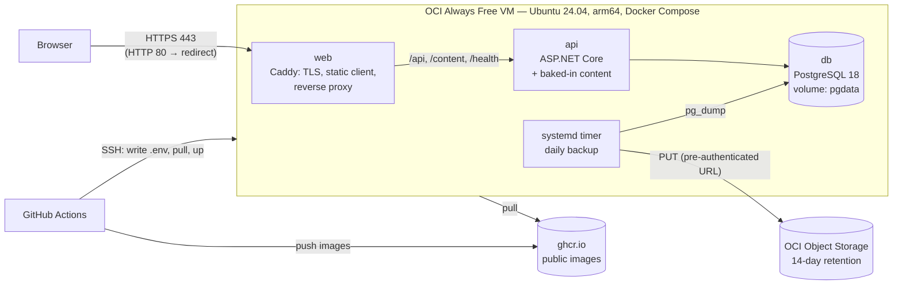

# Design

## Context

What exists today:
- **The API** reads its connection string from `ConnectionStrings:Slovion` and its content from `Content:RootPath`, defaulting to the `content/` folder that `dotnet publish` copies next to the binaries. It runs migrations at startup and serves `/health`, `/api/*` and `/content/*`.
- **The client** calls the API on the same origin (`/api`, `/content`, `/health`); the dev server proxies them. The production build in `client/dist/slovion/browser` includes the service worker, which needs HTTPS outside `localhost`.
- **CI** builds and tests both parts and runs the E2E tests on `ubuntu-latest`.
- **The repository is public.**

The owner chose:
- an OCI Always Free Arm VM
- an `sslip.io` hostname with HTTPS until a domain exists
- deploys on every merge to `main` (later changed by the owner to deploys on published releases; see the implementation notes)
- daily backups to OCI Object Storage
- a runbook with a setup script instead of Terraform

Approved by the project owner on 2026-10-05.

Motivation: see proposal.md. Requirements: `specs/hosting/spec.md`.

## Goals / Non-Goals

**Goals:**
- One automated path from a published release to the live game, with a health check and an automatic rollback.
- Nothing secret in the repository, and nothing on the VM that can't be recreated from the repository plus the GitHub secrets, except the database itself, which is backed up.
- Stay inside the Always Free limits.

**Non-Goals:** see proposal.

## Decisions

### 1. Topology

- **Three containers on one VM**, defined in `deploy/compose.yml`:
  - `web` publishes 80 and 443
  - `api` and `db` sit on an internal network only
  - Caddy keeps its certificates on a named volume (`caddy-data`), so restarts don't request new ones
- **Same origin, as in development:** the client keeps calling `/api` and `/content`, and Caddy routes them. No CORS and no client configuration.
- **Restart policy** `unless-stopped`. A health check on `api` (`/health`) and on `db` (`pg_isready`); `web` waits for a healthy `api`.

### 2. Images

- **`deploy/api.Dockerfile`:**
  - a build stage on the build machine's platform runs `dotnet publish -c Release -a <target arch>` (cross-compiled, no emulation)
  - the final stage, `mcr.microsoft.com/dotnet/aspnet:10.0` for the target platform, only copies the output, `content/` included
  - it runs as the image's non-root user on port 8080
  - the .NET SDK and runtime versions follow `global.json`
- **`deploy/web.Dockerfile`:** a Node 24 build stage runs `npm ci` and `npm run build` (on the build platform; the output is the same for every architecture). The final stage is the official `caddy:2` image with the build output and `deploy/Caddyfile`.
- **Multi-arch without QEMU:** both final stages only copy files, so `docker buildx build --platform linux/arm64,linux/amd64` runs on the standard `ubuntu-latest` runner.
- **Tags:** `ghcr.io/<owner>/slovion-api:<commit-sha>` and `slovion-web:<commit-sha>`, plus `latest` on `main`. Public packages, so the VM pulls without credentials.

### 3. Caddy

- **The site address comes from `SITE_ADDRESS`:**
  - `203-0-113-7.sslip.io` now, `slovion.si` (for example) later: Caddy gets a Let's Encrypt certificate and redirects HTTP to HTTPS
  - `:80` for the CI smoke test: plain HTTP, no certificate
- **Routes:**
  - `/api/*`, `/content/*` and `/health` go to `api:8080`
  - everything else is the static client, with a fallback to `index.html` for deep links (`/play`)
- **Caching:**
  - `index.html`, `ngsw.json`, `ngsw-worker.js` and the manifest get `Cache-Control: no-cache`, so new versions are picked up
  - hashed bundles get `max-age=31536000, immutable`
  - `/content` keeps the API's own `no-cache`
- **Headers:** `X-Content-Type-Options: nosniff`, `Referrer-Policy: no-referrer`, and HSTS once on a real domain (not on `sslip.io`, so the hostname can change freely). No third-party content (D5).
- **Compression:** gzip and zstd.

### 4. Configuration and secrets

| Name | Where | Used by |
|---|---|---|
| `DEPLOY_HOST`, `DEPLOY_USER`, `DEPLOY_SSH_KEY`, `DEPLOY_KNOWN_HOSTS` | GitHub environment `production`, secrets | the deploy workflow's SSH step |
| `POSTGRES_PASSWORD` | `production` secret | `db`, and the API's connection string |
| `BACKUP_URL` | `production` secret | the backup script (a pre-authenticated write URL for the bucket) |
| `SITE_ADDRESS` | `production` variable | Caddy |

- **On every deploy** the workflow writes `/opt/slovion/.env` (mode 600) from these values, together with the image tag. So the repository plus GitHub hold everything needed to rebuild the VM, except the data.
- **The `production` environment** can require approval later; it's not needed now.

### 5. Deployment

`.github/workflows/deploy.yml`, triggered when a GitHub Release (not a pre-release) is published, and by `workflow_dispatch` with a version tag (changed from "every CI-green merge to `main`" at the owner's request, see the implementation notes):

1. **check:** the tag is a version (`vMAJOR.MINOR.PATCH`), and the CI run of its commit on `main` succeeded; a run still in progress is awaited for up to 30 minutes.
2. **build:** buildx, logs in to GHCR with `GITHUB_TOKEN` (`packages: write`), builds and pushes both images for both platforms, tagged with the commit, the version and `latest`.
3. **deploy:**
   1. copies `deploy/compose.yml` and `deploy/backup.sh` to `/opt/slovion` over SSH
   2. writes `.env` with `TAG=<sha>`, `VERSION` and the secrets, keeping the previous `TAG` in `.env.previous`
   3. runs `docker compose pull && docker compose up -d --remove-orphans`
4. **verify:** polls `https://$SITE_ADDRESS/health` for up to 3 minutes.
   - On failure, restore `.env.previous`, `up -d` again, and fail the run.
   - Old images are pruned after a successful deploy.

The site is briefly unavailable while the API restarts and migrates (seconds). That's acceptable for a free hobby deployment, so there's no blue/green.

### 6. Smoke test in CI

A `containers` job in `ci.yml`, on pull requests and `main`, keeps the deploy path tested before anything reaches the VM:
1. builds both images for `linux/amd64` (loaded locally, not pushed)
2. starts `deploy/compose.yml` with `SITE_ADDRESS=:80` and a throwaway password
3. checks:
   - `GET /` returns the client's `index.html`, and so does `GET /play` (the deep-link fallback)
   - `GET /health` returns 200
   - `POST /api/saves` returns a token
   - `GET /content/maps/dravsko_polje_meadow.json` returns 200 with `no-cache`
   - the hashed bundles are served `immutable`

### 7. Backups

- **The script** `deploy/backup.sh`, run daily at 03:30 UTC by a systemd timer that the bootstrap installs:
  1. `docker compose exec -T db pg_dump -Fc` into `/opt/slovion/backups/slovion-<UTC timestamp>.dump`
  2. upload it with `curl --upload-file` to `$BACKUP_URL` (an OCI pre-authenticated request for object writes on the bucket)
  3. keep the newest 3 locally
- **Retention:** the bucket's lifecycle rule deletes objects after 14 days.
- **Failures** show in `systemctl status slovion-backup` and the journal; there is no alerting (a non-goal).
- **Restore:** documented in `docs/hosting.md`: download the dump, `docker compose exec -T db pg_restore --clean --if-exists`. Tested once against the running stack as part of this change.

### 8. VM setup

`deploy/bootstrap.sh`, run once as root on a fresh Ubuntu 24.04 Arm VM (by hand over SSH, or pasted as cloud-init user data):
1. installs Docker Engine and the compose plugin from Docker's apt repository; enables `unattended-upgrades`
2. creates the `slovion` user (in the `docker` group) for deployments, with the public deploy key passed as an argument; creates `/opt/slovion`
3. opens 80 and 443 in iptables (Oracle's Ubuntu images reject them by default) and saves the rules
4. sets `PasswordAuthentication no` for SSH
5. installs `slovion-backup.service` and `slovion-backup.timer`

The OCI side (account, VM shape, network security rules for 80 and 443, bucket, lifecycle rule, pre-authenticated request) is a manual, one-time runbook in `docs/hosting.md`.

### 9. Decision D12

`docs/decisions.md` gains **D12 — Hosting**, recording these choices:
- one OCI Always Free Arm VM with Docker Compose, Caddy, the API and PostgreSQL
- images in GHCR, deploys on published releases (CI must have passed) with health check and rollback
- `sslip.io` until a domain exists
- daily backups to Object Storage

## Risks / Trade-offs

- **[Capacity and idle reclamation]** Free Arm capacity is often unavailable in popular regions, and idle Always Free VMs on free-only accounts can be reclaimed. Mitigation: the runbook recommends upgrading to Pay-As-You-Go (no cost within Always Free limits) and choosing a less busy home region.
- **[Single VM, no SLA]** The VM or its disk can be lost. Mitigation: everything but the data is reproducible from the repository and GitHub, and the data has daily off-VM backups. Up to a day of saves can be lost; acceptable for anonymous saves.
- **[sslip.io]** It's a third-party DNS service. If it's down, the site isn't reachable by name. Mitigation: it's temporary until the domain, and only the `SITE_ADDRESS` variable changes.
- **[Let's Encrypt rate limits]** Repeated fresh certificates for one name are rate-limited. Mitigation: certificates persist on the `caddy-data` volume.
- **[Brief downtime on deploy]** Seconds while the API restarts. Accepted.
- **[SSH from GitHub]** The deploy key can run Docker on the VM. Mitigation: a dedicated user and key, secrets in a GitHub environment, and the host key pinned with `DEPLOY_KNOWN_HOSTS`.

## Testing

- **CI:** the container smoke test (§6) on every pull request; the existing backend, client and E2E jobs unchanged.
- **Scripts:** `bash -n` on the scripts, and the backup script run against the smoke-test stack in CI with a dummy upload target, to check the dump and the local retention.
- **Manual,** on the real VM with the owner:
  - the first deploy over `https://<ip>.sslip.io`, then a second deploy (a changed commit)
  - a forced failed health check, to see the rollback
  - a backup run, its object in the bucket, and a restore
  - installing the app from the HTTPS address

## Implementation notes

### Deviations from the plan

- **Images stay private; the VM logs in per deploy.** The design planned public GHCR packages, so the VM could pull without credentials. Instead, each deploy logs the VM in to GHCR with the run's short-lived `GITHUB_TOKEN`, passed on stdin, and logs out at the end. This works whatever the package visibility, and needs no manual step after the first push.
- **No HSTS yet.** As planned for `sslip.io`; the runbook says to add it to the `Caddyfile` once the domain is final.
- **The bootstrap pre-answers `iptables-persistent`'s debconf questions,** so it never waits for input.
- **Backups are owner-only:** `backup.sh` runs with `umask 077`, and `backups/` is mode 700 (found on the VM after the first deploy).
- **First-deploy bug, fixed in a follow-up:** the *Remove old images* step stopped with exit code 2. On the first deploy there is no `.env.previous`, so `grep` failed under `set -euo pipefail`. The deploy itself had succeeded. Both `grep`s in that step are now guarded.

### What was verified

- **CI** (pull request #29): the new `containers` job builds both images (amd64) and starts the stack over HTTP.
  - All 9 smoke checks passed.
  - Four backup runs left the newest 3 dumps, and the latest one is readable by `pg_restore --list`.
- **The VM** (OCI Always Free, `VM.Standard.A1.Flex`, Ubuntu 24.04.5, aarch64, 5.9 GB RAM, 45 GB disk), after `bootstrap.sh`:
  - Docker 29.8 (arm64), compose 5.6
  - the `slovion` user with the deploy key, Docker access and no sudo
  - iptables accepting 80 and 443
  - SSH with `passwordauthentication no` and `permitrootlogin no`
  - the backup timer scheduled
- **GitHub:** the `production` environment with `DEPLOY_HOST`, `DEPLOY_USER`, `DEPLOY_SSH_KEY`, `DEPLOY_KNOWN_HOSTS` and a generated `POSTGRES_PASSWORD`, plus the variable `SITE_ADDRESS = 138-2-144-201.sslip.io`. The deploy key's private half exists only in GitHub; the local copy was deleted.
- **First deploy** (merge of #29, run 37360076788):
  - images built for both platforms in 3 min, the stack started, the HTTPS health check passed
  - from outside, `deploy/smoke-test.sh https://138-2-144-201.sslip.io` passed all 9 checks
  - the certificate is from Let's Encrypt for `138-2-144-201.sslip.io`, and HTTP answers `308` to HTTPS
  - in Chromium: a new game, walking, and observing the meadow sage worked; the service worker is registered; no console errors
- **A backup by hand on the VM** (`systemctl start slovion-backup`) wrote a dump. With no `BACKUP_URL` set yet, it stays local.

### Deploys on releases (owner's change after the first deploy)

After the first live deploy the owner asked to deploy only on specific releases instead of every merge. The workflow now:
- runs on a published GitHub Release, never a pre-release, or by hand with a version tag
- refuses tags that aren't `vMAJOR.MINOR.PATCH`, and commits whose CI run on `main` didn't succeed (it waits for a run in progress)
- tags the images with the version as well, and writes `VERSION` into `.env`

Merging into `main` only runs CI. The spec's deployment requirement, D12, the runbook, the architecture doc and the README changed with it.

### Still to do with the owner

- Set `BACKUP_URL` (the owner's bucket and pre-authenticated request), deploy, and see a dump arrive in the bucket.
- A forced rollback, and a restore from a dump.
