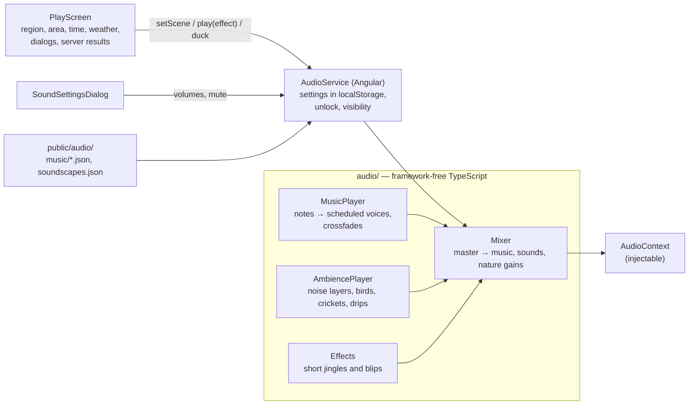

# Design

## Context

What exists today:
- **The game is silent.** `PlayScreen` already knows everything that should shape sound:
  - the current region and area (with `underground`)
  - the in-game time of day (`onTimeChange`) and the weather
  - when dialogs open and close
  - every outcome the server reports: identification results, research levels, completed quests, new tools and certificates, travelling
  - the torch
- **The installed app** caches files from `public/` listed in `ngsw-config.json`.
- **The engine** is framework-free and owns drawing and movement. Sound is presentation driven by UI state, so it belongs next to the UI, not in the world simulation.

The owner chose: synthesized in the browser, soft chiptune, generic nature ambience (real species calls later), on by default.

Approved by the project owner on 2026-10-05.

Motivation: see proposal.md. Requirements: `specs/sound/spec.md`.

## Goals / Non-Goals

**Goals:**
- Each region feels different by ear, and day, night, caves and rain sound different.
- Clear, friendly feedback for the moments that matter: observing, identifying right or wrong, research, quests.
- Small, testable, original; adding a region means adding one soundscape entry and, optionally, one theme.

**Non-Goals:** see proposal.

## Decisions

### 1. Where the code lives



- **The synthesis code** (`client/src/app/audio/synth/`) is plain TypeScript with no Angular imports, written against a narrow `AudioContextLike` interface. Tests pass a recording fake; the browser passes a real `AudioContext`.
- **`AudioService`** is the only Angular part:
  - creates the context on the player's first gesture and loads the data
  - applies the settings and suspends sound while the page is hidden
  - offers `setScene(scene)`, `play(effect)` and `duck(on)`
- **The engine stays untouched.**

### 2. Music

- **Format:** `public/audio/music/<id>.json`, e.g.:

  ```json
  { "id": "meadow", "tempo": 96, "channels": [
      { "wave": "pulse25", "volume": 0.30, "notes": "E5:2 G5:2 A5:4 -:2 G5:2 E5:4 …" },
      { "wave": "triangle", "volume": 0.40, "notes": "C3:4 G3:4 A2:4 E3:4 …" } ] }
  ```

  - each token is `<pitch><octave>:<length in eighth notes>`, or a rest `-:<length>`
  - waves are `square`, `pulse25`, `pulse12` and `triangle`
  - each channel loops; the shortest common length becomes the loop
- **Scheduling:** a look-ahead scheduler (a 25 ms timer that schedules notes up to 100 ms ahead on the audio clock) keeps timing exact even when the page is busy.
- **Envelopes:** short attack and release, so the chiptune stays soft. Volumes are kept low.
- **Night arrangement**, derived from each theme rather than written twice:
  - tempo × 0.75
  - melody on `triangle`, one octave down
  - every second bass note dropped
  - volume × 0.7
- **Underground:** the `cave` track, a slow low drone with sparse high notes, whatever the region.
- **Changes** (region, day ↔ night, entering or leaving a cave) crossfade over 2 seconds.
- **While a dialog is open,** music is at 40 %.
- **Themes:** one per region (nine) plus `cave`. Original melodies written for this change, short loops of 16 to 32 bars. The night arrangements are derived, not stored.

### 3. Ambience

- **`public/audio/soundscapes.json`** maps each map (one per region) to its music and ambience layers by day and by night, e.g.:

  ```json
  { "dravsko_polje": { "music": "meadow", "day": ["breeze", "birds"], "night": ["breeze", "crickets"] },
    "portoroz": { "music": "coast", "day": ["waves", "gulls-generic", "breeze"], "night": ["waves", "crickets"] } }
  ```

- **The layer kinds** are built from noise, filters and slow random modulation (seeded, so tests are deterministic):
  - `breeze`, `wind`: band-passed noise with a slow swell
  - `stream`, `lake`, `waves`: low-passed noise with ripples or a slow wave rhythm
  - `rain`: high-passed noise with random drops
  - `birds`: short chirp phrases with frequency sweeps at random intervals, generic and not modelled on any species
  - `gulls-generic`: rare falling calls, equally generic
  - `crickets`: a pulsed high tone
  - `drips`: rare, plucked high blips with echo
  - `cave-air`: a very low rumble
- **Weather** changes the layers:
  - rain adds `rain` and thins out birds
  - fog softens everything a little
  - snow removes birds and crickets and muffles the wind
- **Underground areas** replace the region's layers with `drips` and `cave-air`.
- **Evening and morning** use the day layers; night uses the night layers.

### 4. Effects

| Effect | When |
|---|---|
| `observe` | an observation (encounter) starts |
| `correct` | a species is identified (a rising four-note jingle) |
| `wrong` | a wrong name was picked (two soft falling notes) |
| `research` | a research level rose (a sparkle) |
| `quest` | a quest is completed (a short fanfare) |
| `tool` | a new tool is received |
| `certificate` | a station certificate is earned |
| `travel` | travelling starts (a soft whoosh) |
| `torch` | the torch is switched (a click) |
| `search` | searching grass, a tree or a shrub (a rustle) |

Effects are short sequences in code (a few notes each), mixed at the *sounds* volume.

### 5. Settings

- **Volumes:** music, sounds and nature, each 0–100 %; defaults 50 %, 70 % and 60 %. Plus `muted` (default off).
- **Storage:** `localStorage` under `slovion.sound`, the same way the save token is stored. It's a device preference, not personal data (D5).
- **The *Zvok* button** (next to *Svetilka* and *Nahrbtnik*) opens `SoundSettingsDialog`: three labelled sliders, a mute switch and *Zapri*. It's keyboard-accessible, like the other dialogs.
- **A quick mute button** shows *Zvok vklopljen* / *Zvok izklopljen*.
- **Texts** live in the `sl-SI` catalog.

### 6. Browser rules

- **Starting:** browsers allow audio only after a user gesture. `AudioService` listens once for the first `pointerdown` or `keydown` on the document, then creates or resumes the context. The *Nova igra* and *Nadaljuj* clicks count.
- **Visibility:** the context is suspended while the page is hidden and resumed when it is shown again.
- **No Web Audio** (very old browsers): sound is skipped silently and the game works as before.
- **Reduced motion** doesn't affect sound.

### 7. Installed app

`ngsw-config.json` adds `/audio/**` to the prefetched `app` group, so music and soundscapes are available offline like sprites and fonts.

## Risks / Trade-offs

- **[Synthesized sound can be harsh]** Mitigation: low default volumes, soft envelopes, triangle and pulse waves rather than raw square leads, and a manual listening pass on desktop and phone speakers.
- **[Mobile browsers]** iOS starts audio only from a gesture and may suspend it. Mitigation: unlock on the first gesture, and resume on visibility and on the next gesture after a suspension.
- **[CPU on phones]** Many oscillators and noise sources at once. Mitigation: at most about 8 active voices and 4 ambience layers; the noise buffers are created once and reused.
- **[Composing nine themes]** Mitigation: short loops, and night variants derived automatically.

## Testing

- **Unit, with a recording fake context:**
  - the note parser (pitches, lengths, rests, errors)
  - the night arrangement
  - the scheduler: notes at the right times, looping, crossfade gains
  - the scene → layers rules: day, night, rain, snow, underground
  - effects
  - the mixer volumes and mute
- **`AudioService`:** settings load and save, defaults, unlock on the first gesture, suspend and resume on visibility, no Web Audio.
- **`PlayScreen` wiring** (fake `AudioService`):
  - scenes for region, area, time and weather
  - an effect per event in the table above
  - ducking while a dialog is open
- **Data:** a client test checks that every theme parses and every soundscape names a known theme and known layers. A .NET content test checks that every region's map has a soundscape (the client's test build has no file system access to list `content/`).
- **E2E:** the *Zvok* dialog opens; changing a slider and muting survive a reload.
- **Manual:**
  - listen to every region by day and at night, a cave, rain, and every effect, on desktop speakers and a phone
  - check that sound starts on the first click and stops when the tab is hidden

## Implementation notes

### Deviations from the plan

- **`AudioService` is created at app start** (`provideAppInitializer` in `app.config.ts`). Created lazily by the play screen, it missed the click on *Nova igra*, so sound only began with the next key press. An instrumented browser check found this; the E2E test now checks that the click on *Nova igra* makes a running audio context and that nothing exists before it.
- **`SoundEngine.stop()`** stops the music and ambience timers when the service is destroyed, so tests leave no intervals running. **`AudioService.state`** exposes the current theme and layers for tests and debugging.
- **`setupTestApp` takes extra providers,** so the play-screen tests can use a recording `FakeAudioService` (`audio/testing/`). jsdom has no Web Audio, so the other play-screen tests run without sound and without the sound buttons, which is itself the no-Web-Audio case.
- **The voice and layer limits are enforced by data, not at runtime:** a client test allows at most 3 ambience layers per soundscape (4 with rain) and 3 channels per theme. Effects are short and the timed ambience sounds sparse, so about 8 voices is the practical peak; there is no voice stealing.
- **The themes were written with a one-off generator script** that isn't in the repository. The JSON files are the source; [content.md](../../../docs/content.md#sound) documents the format for editing by hand.

### What was verified, and how

- **Automated:**
  - `npm run check`: format, lint, i18n keys, 419 unit and component tests, build
  - all 11 E2E tests, including the sound settings surviving a reload and the music and soundscapes served offline by the service worker
  - `dotnet test` in Release, including the soundscape-per-region content test
- **In Chromium, with `AudioContext` instrumented:**
  - no audio context before the click on *Nova igra*, then one running context
  - all 10 themes and the soundscapes loaded
  - notes kept being scheduled (14 oscillators after 3 s, 27 after 6 s) together with the ambience noise
  - the torch played its effect
  - no console errors
- **Not yet done: the listening pass (task 4.4).** It needs a person with speakers and a phone: every region by day and at night, a cave, rain, and every effect. Hiding the tab is covered by a unit test with a fake context, not in a real browser.
